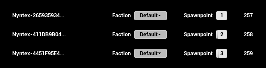
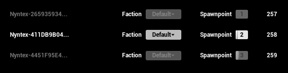

# SimpleLobby
This project was made only to showcase that I have experience with Unreal Engines sessions, that I know who authority has and what it means and that I know how to do remote procedure calls to the hosting client as well es replicating general information from one client to the next. The UI is not supposed to be pretty but functional.

This project was made during my 3rd semester at [S4G school for Games](https://www.school4games.net/). The reason for this project is another project I'm working that incorporates this one, or rather, this one was created because of the other, my [RTS System](https://github.com/Nyntex/RTS_System).

---

It has a **Main Menu** that includes a **Server Browser** in which you can create your own lobbies with a player count of up to 8. 

In the lobby the host has total control over all players:

While the players can only control their own settings:

Only the host can start the game where all players will be put through the transition map and then together into the game level where the game mode.

---

This project uses was made using the [Unreal Engine 5.3](https://www.unrealengine.com/en-US/) by Epic Games and the [Advanced Sessions Plugin](https://vreue4.com/advanced-sessions-binaries) by [mordentral](https://github.com/mordentral) to have access to steam specific functions.
